# FUNNEL-TABS-AUDIT — Аудит вкладок настроек вакансии

**Дата:** 2026-06-06  
**Тип:** read-only, код не менялся  
**Объект:** `app/(modules)/hr/vacancies/[id]/page.tsx` → settingsSection

---

## 0. Контекст: что такое настройки вакансии

Страница вакансии имеет верхний таб `settings` (Настройки), внутри которого есть боковое меню подразделов (`settingsSection`). Аудит охватывает 5 подразделов:

| `settingsSection` | Лейбл в UI |
|---|---|
| `funnel` | Воронка |
| `funnel-builder` | Конструктор воронки [Beta] |
| `messages` | Сообщения |
| `followup` | Дожим |
| `aichatbot` | AI чат-бот |

---

## A. Mermaid-схема

```mermaid
flowchart TD
    subgraph UI["UI — Вкладки настроек вакансии"]
        V["Воронка\n(funnel)"]
        FB["Конструктор\nворонки Beta\n(funnel-builder)"]
        M["Сообщения\n(messages)"]
        FU["Дожим\n(followup)"]
        AI["AI чат-бот\n(aichatbot)"]
    end

    subgraph DB["Хранилище в БД (vacancies)"]
        PL["descriptionJson.pipeline\n← VacancyPipelineV2"]
        FCJ["funnelConfigJson\n← FunnelConfig {blocks[]}"]
        FBE["funnelBuilderEnabled\n(bool)"]
        FRE["funnelRuntimeEnabled\n(bool)"]
        APS["aiProcessSettings {}\n(многие soft-флаги)"]
        AIC["aiChatbotEnabled +\naiChatbotPrompt +\naiChatbotSettings"]
        FMC["firstMessagesChain\n(json[]|null)"]
        RME["recoveryMessageEnabled+Text"]
        SWJ["stopWordsJson\n(string[])"]
        SFJ["stopFactorsJson\n(VacancyStopFactors)"]
        REQ["requirementsJson"]
        FUC["follow_up_campaigns\n(отдельная таблица)"]
        DJ["descriptionJson.*\n(automation, finalScreens, branding...)"]
    end

    subgraph RUNTIME["Рантайм-потребители"]
        PQ["process-queue.ts\n(разбор откликов hh)"]
        SI["scan-incoming.ts\n(входящие сообщения)"]
        CF["cron/follow-up\n(дожим)"]
        SSF["should-stop.ts\n(стоп-условия дожима)"]
        RT["runtime.ts isBlockEnabled()\n(gate/адаптер Phase 3)"]
    end

    %% Воронка (funnel)
    V --> PL
    V --> APS
    V --> SFJ
    V --> SWJ
    V --> DJ
    PL -->|"getStageHhAction()\nparsePipeline()"| PQ
    SFJ -->|"matchStopFactors()"| PQ
    SWJ -->|"matchStopWordList()"| SSF

    %% Конструктор воронки (funnel-builder)
    FB --> FCJ
    FB --> FBE
    FB -->|"dual-write PUT\n/funnel-config"| AIC
    FB -->|"dual-write"| APS
    FB -->|"dual-write"| RME
    FCJ -->|"при funnelRuntimeEnabled=true"| RT
    RT -->|"isBlockEnabled()"| PQ
    RT -->|"isBlockEnabled()"| SI
    RT -->|"isBlockEnabled()"| SSF

    %% Сообщения (messages)
    M --> FMC
    M --> RME
    M -->|"inviteMessage → APS"| APS
    FMC -->|"scheduleFirstMessagesChain()"| PQ
    APS -->|"inviteMessage fallback"| PQ
    RME -->|"recovery message"| PQ

    %% Дожим (followup)
    FU --> FUC
    FU --> REQ
    FU --> APS
    FUC -->|"generateTouchSchedule()"| PQ
    FUC -->|"processCampaignTouches()"| CF
    SSF -->|"shouldStopFollowUp()"| CF

    %% AI чат-бот (aichatbot)
    AI --> AIC
    AIC -->|"processChatbotMessage()"| SI

    %% Dual-write связи
    FBE -.->|"UI предупреждение"| V
    FBE -.->|"UI предупреждение"| M
    FBE -.->|"UI предупреждение"| FU
    FBE -.->|"UI предупреждение"| AI

    style RT fill:#fffbe6,stroke:#f59e0b
    style FRE fill:#ffe4e4,stroke:#ef4444
```

**Легенда dual-write (стрелки из FB):** При сохранении `PUT /api/modules/hr/vacancies/[id]/funnel-config` зеркалит:
- `ai_chatbot.enabled` → `vacancies.aiChatbotEnabled`
- `ai_resume_score.enabled` → `vacancies.aiScoringEnabled`
- `dozhim.enabled` → `aiProcessSettings.followupEnabled`
- `prequalification.enabled` → `aiProcessSettings.prequalEnabled`
- `ai_anketa_score.enabled` → `aiProcessSettings.aiAnketaScoreEnabled`
- `auto_reply_test_task.enabled` → `aiProcessSettings.testTaskAutoReplyEnabled`
- `stop_words_chat.enabled` → `aiProcessSettings.stopWordsChatEnabled`
- `stop_factors_resume.enabled` → `aiProcessSettings.stopFactorsEnabled`
- `first_message.enabled` → `aiProcessSettings.firstMessageEnabled`
- `recovery.enabled` → `vacancies.recoveryMessageEnabled`
- `call_intent.enabled` → `descriptionJson.automation.callIntent.enabled`

---

## B. Таблица по вкладкам и фичам

### Вкладка 1: Воронка (`funnel`)

| Фича | Хранилище | Рантайм-потребитель | Статус | Комментарий |
|---|---|---|---|---|
| Редактор стадий (FunnelTab) | `descriptionJson.pipeline` (VacancyPipelineV2) | `getStageHhAction()` → `process-queue.ts` — hh invite/discard при смене стадии | ✅ | `parsePipeline()` читается при каждом разборе отклика; hhAction влияет на реальные вызовы hh API |
| Пресеты воронки (fast/standard/deep) | `descriptionJson.pipeline.preset` | Только UI | ⚠️ | Пресет влияет только на enabled-стадии при инициализации, не на рантайм |
| AutomationSettings секция `pipeline` | `descriptionJson.pipeline` (через отдельный PUT /pipeline) | Тот же process-queue | ✅ | Дубль UI для pipeline — секция AutomationSettings рендерит подтаб настройки pipeline, но **это то же поле**, что и FunnelTab |
| VacancyPrequalificationSettings | `vacancies.aiProcessSettings.prequalification.*` + `prequalEnabled` | `process-queue.ts → startPrequalification()` при score в mid-range | ✅ | Конфиг опросника, применяется в живом рантайме |
| VacancyStopFactorsSettings | `vacancies.stopFactorsJson` | `matchStopFactors()` в `process-queue.ts` — автоотказ ДО AI-скоринга | ✅ | Реально работает; предохранитель `stopFactorsApplyToAll` = false по умолчанию |
| VacancyStopWordsSettings | `vacancies.stopWordsJson` | `should-stop.ts → shouldStopFollowUp()` — проверяет ответы анкеты при дожиме | ✅ | Читается крон дожима; P0-14 отключил regex в scan-incoming, поэтому стоп-слова в **чате** не работают через scan-incoming (закомментировано) |
| FinalScreensSettings (финальные экраны) | `descriptionJson.finalScreens` | Публичная страница `/demo/[token]` | ✅ | UI-текст экранов, потребитель — фронтенд кандидата |
| PostDemoSettings (пост-демо) | `descriptionJson.*` (несколько полей) | Публичная страница кандидата | ✅ | Настройки поведения после демо |

**Итого по вкладке Воронка:** Смешаны 4 разных семантических зоны — (1) стадии kanban, (2) AI-фильтр откликов (prequalification/stop factors), (3) стоп-слова, (4) финальные экраны демо. Связь с `funnel-builder` через предупреждение UI, но не через данные.

---

### Вкладка 2: Конструктор воронки [Beta] (`funnel-builder`)

| Фича | Хранилище | Рантайм-потребитель | Статус | Комментарий |
|---|---|---|---|---|
| Список блоков (enable/disable/reorder) | `vacancies.funnelConfigJson` | `isBlockEnabled()` в `runtime.ts` — только при `funnelRuntimeEnabled=true` | ⚠️ | Сам конфиг хранится, но `funnelRuntimeEnabled=false` по умолчанию → рантайм НЕ читает его. Потребитель — только dual-write |
| `funnelBuilderEnabled` (флаг "Beta активен") | `vacancies.funnelBuilderEnabled` | Только UI (показывает предупреждение на других вкладках) | ⚠️ | Не влияет на рантайм, только косметический флаг в UI |
| `funnelRuntimeEnabled` (флаг "рантайм читает config") | `vacancies.funnelRuntimeEnabled` | `runtime.ts isBlockEnabled()` → `process-queue.ts`, `scan-incoming.ts`, `should-stop.ts` | ✅ | Главный переключатель Phase 3. При `true` рантайм читает `funnelConfigJson` вместо legacy-полей |
| Dual-write при сохранении | legacy-поля (aiChatbotEnabled, aiScoringEnabled, aiProcessSettings.*...) | Все cron'ы через legacy-поля | ✅ | Работает корректно — 11 маппингов, см. раздел A |
| Шестерёнки блоков (Sheet-настройки) | Каждый блок использует свой компонент из `BLOCK_SETTINGS_REGISTRY` | Зависит от блока | ✅/⚠️ | Компоненты переиспользуют те же UI-компоненты, что в отдельных вкладках |

**Главный вывод по конструктору:**
- `funnelBuilderEnabled=true` + `funnelRuntimeEnabled=false` (состояние по умолчанию для Beta) = конструктор **только UI-заглушка**: блоки редактируются, dual-write обновляет legacy, но рантайм читает legacy напрямую (как до конструктора).
- `funnelRuntimeEnabled=true` = рантайм переключается на `funnelConfigJson` через адаптер `isBlockEnabled()`.

---

### Вкладка 3: Сообщения (`messages`)

| Фича | Хранилище | Рантайм-потребитель | Статус | Комментарий |
|---|---|---|---|---|
| FirstMessagesChainEditor (серия 1-3 сообщений) | `vacancies.firstMessagesChain` (jsonb array) | `scheduleFirstMessagesChain()` в `process-queue.ts` (msg2/msg3) + msg1 через `changeNegotiationState` | ✅ | Реально работает; msg1 текст берётся из `aiProcessSettings.inviteMessage` (fallback DEMO_INVITE_MESSAGE) |
| AutomationSettings секция `firstMessage` | `aiProcessSettings.inviteMessage` | `process-queue.ts` — текст приглашения msg1 | ✅ | Это **тот же** inviteMessage, который FirstMessagesChainEditor использует как fallback; сохраняется отдельно |
| AutomationSettings секция `callIntent` | `descriptionJson.automation.callIntent.*` | `scan-incoming.ts` — matchCallIntentKeyword() | ✅ | Реально работает; mode=insist-demo активен |
| AutomationSettings секция `templates` | `aiProcessSettings.inviteMessage` + другие | Нет отдельного потребителя | ⚠️ | Шаблоны — UI для редактирования текстов, потребитель — process-queue |
| RecoveryMessageSettings (аварийное сообщение) | `vacancies.recoveryMessageEnabled`, `vacancies.recoveryMessageText` | `process-queue.ts` — при `previouslyInvited=true && recoveryEnabled` | ✅ | Работает |
| Off-hours настройки | `vacancies.firstMessageOffHoursEnabled`, `firstMessageOffHoursText`, `firstMessageOffHoursDelaySeconds` | `process-queue.ts` offHoursSoftMode | ✅ | Работает |

**Пересечения:**
- `firstMessagesChain` и `inviteMessage` взаимосвязаны: chain[0] = msg1, текст из inviteMessage. Два поля, один смысл.
- Секция `callIntent` из AutomationSettings рендерится в tabKey=`messages`, но концептуально это «реакция на сообщение кандидата» → пересекается с scan-incoming (AI чат-бот делает то же самое умнее).

---

### Вкладка 4: Дожим (`followup`)

| Фича | Хранилище | Рантайм-потребитель | Статус | Комментарий |
|---|---|---|---|---|
| VacancyRequirementsSettings (требования v2) | `vacancies.requirementsJson` | `screenResume()` в `process-queue.ts` — двухпроходный AI-скоринг v2 | ✅ | Реально используется при `aiScoringEnabled=true` |
| VacancyAiProcessSettings (AI-фильтр, пороги) | `vacancies.aiProcessSettings` (minScoreLower, minScoreUpper, midRangeAction) | `process-queue.ts` — скоринг + belowThreshold-логика | ✅ | Ключевой компонент. Определяет судьбу кандидатов по score |
| VacancyFollowupSettings (цепочка дожима) | `follow_up_campaigns` (отдельная таблица) + `descriptionJson.followupCustomDays` | `generateTouchSchedule()` → `process-queue.ts`; `processCampaignTouches()` → `cron/follow-up` | ✅ | Полностью работает |
| VacancyTestFollowupSettings (дожим по тесту) | `follow_up_campaigns.testEnabled/testPreset/testMessages` | `cron/follow-up` (через ту же таблицу) | ✅ | Работает независимо |

**Проблема размещения:** Вкладка называется «Дожим», но содержит `VacancyRequirementsSettings` + `VacancyAiProcessSettings` — это **AI-скоринг резюме** (принятие решений при ИМПОРТЕ откликов), а не дожим (напоминания уже приглашённым). Семантически неверно расположены.

---

### Вкладка 5: AI чат-бот (`aichatbot`)

| Фича | Хранилище | Рантайм-потребитель | Статус | Комментарий |
|---|---|---|---|---|
| Kill-switch вакансии (`aiChatbotEnabled`) | `vacancies.aiChatbotEnabled` | `scan-incoming.ts` — `isBlockEnabled(candVac, "ai_chatbot", ...)` | ✅ | Работает |
| Промпт (`aiChatbotPrompt`) | `vacancies.aiChatbotPrompt` | `processChatbotMessage()` в `scan-incoming.ts` | ✅ | Работает |
| Настройки (pre/post-filter, watcher, sensitivity) | `vacancies.aiChatbotSettings` (jsonb) | `processChatbotMessage()` — pre-filter Haiku, post-filter | ✅ | Полностью работает |
| Response timing | `aiChatbotSettings.responseTiming` | `processChatbotMessage()` — delaySeconds, shortMessages | ✅ | Работает |
| Abuse history / undo | API `abuse-history`, `undo-action` | Только UI | ✅ | UI для истории |
| Sandbox (тестирование) | Не сохраняет в БД | `POST /ai-chatbot/sandbox-message` с dryRun=true | ✅ | Полностью изолирован |
| Kill-switch компании (`aiChatbotKilled`) | `companies.aiChatbotKilled` | `processChatbotMessage()` — проверяется первым | ✅ | Platform-level kill |

---

## C. Матрица дублей

| Блок в Конструкторе | Отдельная вкладка / компонент | Связь | Статус |
|---|---|---|---|
| `ai_chatbot` | Вкладка **AI чат-бот** (`AiChatbotSettings`) | Dual-write: `enabled` → `aiChatbotEnabled`. При `funnelRuntimeEnabled=true` рантайм читает блок | 🔁 Дубль UI. Источник правды зависит от `funnelRuntimeEnabled` |
| `first_message` | Вкладка **Сообщения** (`FirstMessagesChainEditor`) | Dual-write: `enabled` → `aiProcessSettings.firstMessageEnabled`. Настройки хранятся в `firstMessagesChain` (отдельно) | 🔁 Только тумблер include/exclude, не сами тексты |
| `dozhim` | Вкладка **Дожим** (`VacancyFollowupSettings`) | Dual-write: `enabled` → `aiProcessSettings.followupEnabled` | 🔁 Только тумблер, не настройки кампании |
| `stop_factors_resume` | Вкладка **Воронка** (`VacancyStopFactorsSettings`) | Dual-write: `enabled` → `aiProcessSettings.stopFactorsEnabled` | 🔁 Только тумблер |
| `stop_words_chat` | Вкладка **Воронка** (`VacancyStopWordsSettings`) | Dual-write: `enabled` → `aiProcessSettings.stopWordsChatEnabled` | 🔁 Только тумблер |
| `prequalification` | Вкладка **Воронка** (`VacancyPrequalificationSettings`) | Dual-write: `enabled` → `aiProcessSettings.prequalEnabled` | 🔁 Только тумблер |
| `ai_resume_score` | Вкладка **Дожим** (`VacancyAiProcessSettings` + `VacancyRequirementsSettings`) | Dual-write: `enabled` → `aiScoringEnabled` | 🔁 Только тумблер |
| `ai_anketa_score` | Вкладка **Дожим** (PostDemoSettings секция thresholds) | Dual-write: `enabled` → `aiProcessSettings.aiAnketaScoreEnabled` | 🔁 Только тумблер |
| `recovery` | Вкладка **Сообщения** (`RecoveryMessageSettings`) | Dual-write: `enabled` → `recoveryMessageEnabled` | 🔁 Только тумблер |
| `call_intent` | Вкладка **Сообщения** (AutomationSettings секция callIntent) | Dual-write: `enabled` → `descriptionJson.automation.callIntent.enabled` | 🔁 Только тумблер |
| `interview` | Вкладка **Расписание** (нет в 5 аудируемых) | Dual-write: `enabled` → `aiProcessSettings.interviewEnabled` | 🔁 |
| `thank_you_screen` | Вкладка **Воронка** (`FinalScreensSettings`) | Dual-write: `enabled` → `aiProcessSettings.thankYouScreenEnabled` | 🔁 |

**Ключевое наблюдение:** Конструктор воронки [Beta] НЕ дублирует сами настройки отдельных вкладок. Каждый блок в конструкторе — это **только тумблер включён/выключен**, настройки открываются в Sheet и переиспользуют существующие компоненты (`BLOCK_SETTINGS_REGISTRY`). Dual-write синхронизирует тумблеры с legacy-полями.

---

## D. Рекомендации: оставить / объединить / удалить

### Статус-итог по фичам

| Фича | Статус | Рекомендация |
|---|---|---|
| Стадии воронки (FunnelTab / parsePipeline) | ✅ Работает | **Оставить**. Источник правды для hh-действий |
| Конструктор воронки [Beta] | ⚠️ Частично (dual-write работает, runtime нет без флага) | **Оставить как есть** — это будущая замена, Phase 3 не закончена |
| `funnelBuilderEnabled` флаг | ❌ Только UI-косметика | **Оставить** (нужен для предупреждений) но документально обозначить |
| `funnelRuntimeEnabled` флаг | ✅ Ключевой переключатель | **Оставить**. Включать per-вакансия после тестирования |
| Серия первых сообщений (firstMessagesChain) | ✅ Работает | **Оставить** |
| `inviteMessage` в aiProcessSettings | ✅ Fallback для msg1 | **Оставить** как fallback, не удалять |
| `reInviteMessage` в aiProcessSettings | ❌ Больше не используется как fallback (закомментировано в PQ, см. комментарий #46) | **Можно удалить UI**, данные в БД — не мешают |
| RecoveryMessageSettings | ✅ Работает | **Оставить** |
| CallIntent / insist-demo | ✅ Работает | **Оставить** |
| Стоп-факторы (stopFactorsJson) | ✅ Работает в process-queue | **Оставить** |
| Стоп-слова в чате (stopWordsJson) | ⚠️ Частично — работает в should-stop (дожим), regex в scan-incoming **закомментирован** (P0-14) | **Задача отдельная**: включить стоп-слова в scan-incoming обратно или объяснить почему выключены |
| AI-скоринг (requirementsJson + aiProcessSettings) | ✅ Работает | **Оставить**. Переместить UI из «Дожима» в «Воронку» или в отдельный раздел «AI» |
| Дожим (follow_up_campaigns) | ✅ Работает | **Оставить** |
| Дожим по тесту (testEnabled/testPreset) | ✅ Работает | **Оставить** |
| AI чат-бот (полностью) | ✅ Работает | **Оставить** |
| Предквалификация (prequalification) | ✅ Работает | **Оставить** |
| VacancyStopWordsSettings в вкладке Воронка | ✅ Хранит данные | **Оставить**, но добавить комментарий что в чате не работает (P0-14) |

### Целевая структура вкладок (предложение)

Текущее хаотичное расположение:
- «Воронка» содержит: стадии + prequalification + stop factors + stop words + финальные экраны демо
- «Дожим» содержит: AI-скоринг резюме (не относится к дожиму!) + цепочку дожима

Предлагаемое переименование/перераспределение (без удаления компонентов):

| Новое название | Содержимое | Текущее размещение |
|---|---|---|
| **Воронка** | Стадии kanban + hh-действия | funnel (часть) |
| **AI-отбор** | Стоп-факторы + Требования/Скоринг + Предквалификация | funnel + followup (перемешаны) |
| **Сообщения** | Первые сообщения + Recovery + CallIntent | messages (почти ок) |
| **Дожим** | Только цепочка дожима + дожим по тесту | followup (часть) |
| **AI чат-бот** | Без изменений | aichatbot |
| **Конструктор [Beta]** | Без изменений | funnel-builder |

> ⚠️ Это только UI-реструктуризация — данные в БД и логика рантайма **не меняются**.

---

## E. План безопасного рефакторинга

### Шаг 0 — ничего не трогать: безопасные наблюдения

Следующее **можно задокументировать** без изменений кода:
1. `reInviteMessage` (поле в UI AutomationSettings) больше не используется рантаймом как auto-fallback после PR #46. Поле живо в БД, но в `process-queue.ts` закомментировано. Конкретный impact: у вакансий, которые раньше использовали reInviteMessage как второй текст — сейчас шлётся первый текст повторно. Нужно решение.
2. Стоп-слова в чате (`scan-incoming.ts`) были выключены директивой P0-14. Причина не задокументирована в коде (только комментарий `// P0-14 disabled`). Нужна задача: либо включить с вакансии-флагом, либо задокументировать решение.

### Шаг 1 — мёртвый UI (нет риска, можно делать)

Следующие UI-элементы можно убрать или скрыть без влияния на рантайм:
- Секция «Воронка найма» в AutomationSettings — уже закомментирована с комментарием `/* удалена в Ф1 */`. Можно удалить мёртвый код.
- Секция «Автоматические действия» в AutomationSettings — аналогично закомментирована.
- Секция `enrichment` (дозапрос данных) в AutomationSettings — Switch задизаблен, badge «Скоро». Это stub-UI.
- Таб «Интеграции» — весь контент задизаблен с badge «Скоро» (Битрикс24, AmoCRM, другая CRM). Мёртвый stub. **НЕ удалять** — лучше заменить на осмысленный placeholder.

### Шаг 2 — UI-реструктуризация (без риска, чисто косметика)

После Шага 1 — переместить компоненты между settingsSection без изменения логики:
- `VacancyAiProcessSettings` + `VacancyRequirementsSettings` из `followup` → в `funnel` (или новый раздел `ai-filter`)
- Убрать дубль `AutomationSettings sections={["pipeline"]}` из вкладки Воронка — это тот же pipeline, что редактирует FunnelTab

### Шаг 3 — Phase 3 завершение (требует тестирования)

Включить `funnelRuntimeEnabled=true` на тестовой вакансии:
- Конструктор становится источником правды
- Рантайм (process-queue, scan-incoming, should-stop) читает `funnelConfigJson` через адаптер
- Отдельные вкладки (Сообщения, Дожим, AI чат-бот) остаются UI-интерфейсами для блоков — dual-write синхронизирует обратно

### Шаг 4 — слияние вкладок (только после Phase 3, высокий риск)

Когда `funnelRuntimeEnabled=true` для всех новых вакансий — можно начать скрывать отдельные вкладки и перенаправлять HR в конструктор. **НЕ ДЕЛАТЬ** до полной проверки dual-write на проде.

---

## Риски

| Риск | Описание | Приоритет |
|---|---|---|
| ⚡ **OUTWARD-HH** | Стадии воронки (pipeline.hhAction) напрямую вызывают `changeNegotiationState` — реальные действия в hh.ru. Любое изменение парсинга pipeline влечёт реальные invite/discard. | КРИТИЧНЫЙ |
| ⚡ **OUTWARD-HH** | `process-queue.ts` при `stop_factors_resume` вызывает `discard_by_employer` через hh API. Нельзя менять логику без отдельного OK | КРИТИЧНЫЙ |
| 🟡 Двойные сообщения | Если `firstMessagesChain` и старый `inviteMessage` оба активны — кандидат может получить два msg1. `scheduleFirstMessagesChain` защищает, но только при корректном chain | СРЕДНИЙ |
| 🟡 Стоп-слова в чате | P0-14 отключил regex в scan-incoming. Сейчас стоп-слова **работают только для дожима** (should-stop), но не для прямых ответов в чате. HR может не знать об этом | СРЕДНИЙ |
| 🟢 dual-write | При сохранении конструктора legacy-поля обновляются атомарно в одном UPDATE. Риск рассинхрона минимален | НИЗКИЙ |
| 🟢 funnelRuntimeEnabled | По умолчанию `false` у всех. Включение на конкретной вакансии — точечный эксперимент без side-effects | НИЗКИЙ |

---

## F. Краткая справка по источникам правды

| Аспект | Источник правды (сейчас) |
|---|---|
| Стадии kanban + hh-действия | `descriptionJson.pipeline` (VacancyPipelineV2) |
| AI чат-бот вкл/выкл | `vacancies.aiChatbotEnabled` (legacy) OR `funnelConfigJson.ai_chatbot.enabled` при `funnelRuntimeEnabled=true` |
| Тексты AI чат-бота | `vacancies.aiChatbotPrompt` + `aiChatbotSettings` |
| AI-скоринг резюме вкл/выкл | `vacancies.aiScoringEnabled` |
| Требования для скоринга | `vacancies.requirementsJson` (v2) + `aiProcessSettings.*` (v1 пороги) |
| Первое сообщение (текст) | `aiProcessSettings.inviteMessage` (источник правды для msg1) |
| Серия сообщений (задержки/chain) | `vacancies.firstMessagesChain` |
| Дожим (настройки кампании) | `follow_up_campaigns` (таблица) |
| Расписание дожима | `descriptionJson.followupCustomDays` |
| Стоп-факторы (конфиг) | `vacancies.stopFactorsJson` |
| Стоп-слова (список) | `vacancies.stopWordsJson` |
| Предквалификация (вопросы) | `aiProcessSettings.prequalification` |
| Блоки конструктора (enabled) | `vacancies.funnelConfigJson` — при `funnelRuntimeEnabled=true`; иначе legacy-поля |

---

*Аудит проведён 06.06.2026. Код не изменялся.*
